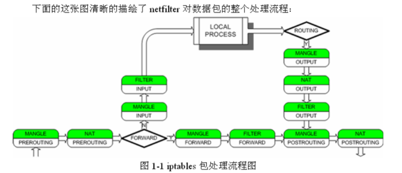
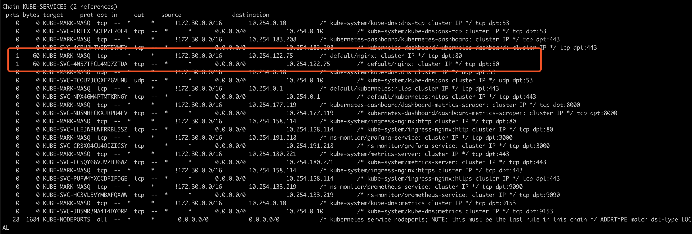

# Kubernetes Service 随笔

## 环境信息
version: v1.18.2  
cni: flannel  
proxyMode: iptables

## iptables
从 **iptables** 说起

iptables: is a user-space utility program that allows a system administrator to configure the IP packet filter rules of the Linux kernel firewall, implemented as different Netfilter modules

[Iptables](https://en.wikipedia.org/wiki/Iptables)  
[Netfilter](https://en.wikipedia.org/wiki/Netfilter)

### iptables 四表五链的工作流程
```
tables: raw, mangle, filter, nat
chains: PREROUTING, FORWARD, INPUT, OUTPUT, POSTROUTING
```



**PREROUTING**
1. 数据包到达网络设备
2. 进入 iptables 的 raw 表，此时报文还未进入内核，属于原始报文
3. 进入 iptables 的 mangle 表，在 mangle 表里一般用来对报文做MARK
4. 进入 iptables 的 nat 表，一般用来做 dnat 功能（修改报文的目的ip）

**路由** 

**FORWARD**

**POSTROUTING**

## pod 的网络通信


## Kubernetes Service 实现原理分析

**ClusterIP**

a. 在 k8s 集群创建一个 `ClusterIP` 类型的 `service`, 其 `ip` 为 `10.254.122.75`, `port` 为 `80`

b. 在集群内的任一节点执行 `curl 10.254.122.75:80` ，可以正常访问服务，通过 `kubectl get ep` 获取对应的后端有若干个 `pod`


实现流程如下

c. 数据包首先进入 iptable 的 `PREROUTING` 链，依次进入 `raw` 表、 `mangle` 表、 和 `nat` 表，根据上文总结，k8s 只操作 `nat` 表，直接查看  `PREROUTING` 链的 `nat` 表：


d. 数据包命中，随后数据包进入 `KUBE-SERVICES` 链，先后命中 `KUBE-MARK-MASQ` 和 `KUBE-SVC-4N57TFCL4MD7ZTDA` 链



e. 数据包随后进入 `KUBE-MARK-MASQ` 链，k8s 为该报文打上 `0x4000` 的标记 (具体用途后续介绍)


f. 然后报文进入 `KUBE-SVC-4N57TFCL4MD7ZTDA` 链，并在其规则中完成 `loadbalance`, 本例中，报文随机命中 `KUBE-SEP-EZ6FKUNEIONYFN4Z` 链


h. 随后报文进入 `KUBE-SEP-EZ6FKUNEIONYFN4Z` 链，并在该链中完成 `dnat`，实现从 `service ip` 到 实际 endpoint `pod id` 的转换，对应 `kubectl get ep` 获取到的后端


i. 完成 `dnat` 之后，报文完成所有 `PREROUTING` 表，进入 `routering decision` 阶段，
数据报文的 `源ip` 为本地ip，目的ip 为 dnat 之后的ip（172.30.1.12:80)，查看本地路由, 此时有两种情况
  i.1 命中本节点，报文进入 cni0 设备
  i.2 命中其他节点，报文进入 flannel.1 设备


**ClusterIP(headless)**  

1. 什么是无头服务？ 
[Headless Service](https://kubernetes.io/docs/concepts/services-networking/service/#headless-services)

2. 创建一个无头服务 —— 指定服务类型为 `ClusterIP`, 且设置 `Spec.ClusterIP` 为 `None`， 对于无头服务，`kubernetes` 不会为其分配 `ClusterIP`, `kube-proxy` 也不会处理(无规则下发)，由 `dns` 根据 `selector` 自动配置转发：

a. 如果配置 `selector`, `DNS` 直接指向后端 `pods`  
b. 如果未配置 `selector`, `DNS` 指向和 `service` 名称相同的任意后端, 或 externalName 类型的服务

3. `headless service` 对应的 `endpoints`


4. 通过 `nslookup` 解析无头服务域名对应的后端ip


也就是说，无头服务通过 `dns` 的能力实现 `loadbalance` ，不经过 k8s 实现机制，直接将请求转发到后端的 `pod` 上

**NodePort**

1. 创建一个 `NodePort` 类型的 `service`，访问集群的任一台节点的 ip + port（本例为31980） 均可以正常连接


2. 检查被访问的节点（或者是任意节点）的 `iptables` 规则，数据包先后进入 `PREROUTING` 链的 `raw` 表，`mangle` 表， 和 `nat` 表（前文已介绍，raw 和 mangle 表均没有规则，默认通过），直接查看 `nat` 表规则


**LoadBalancer**